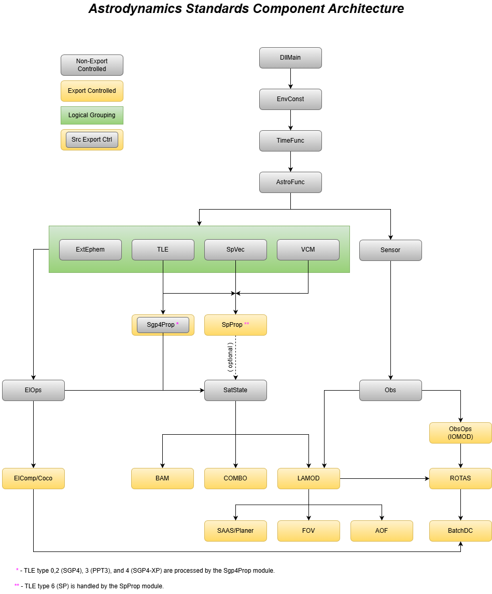
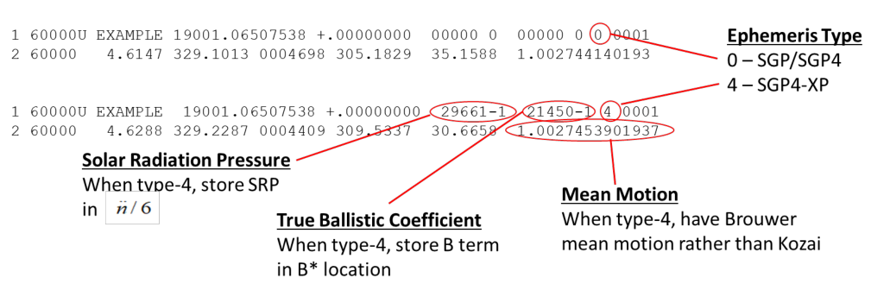
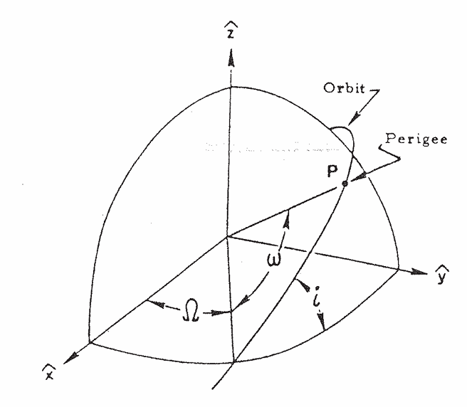
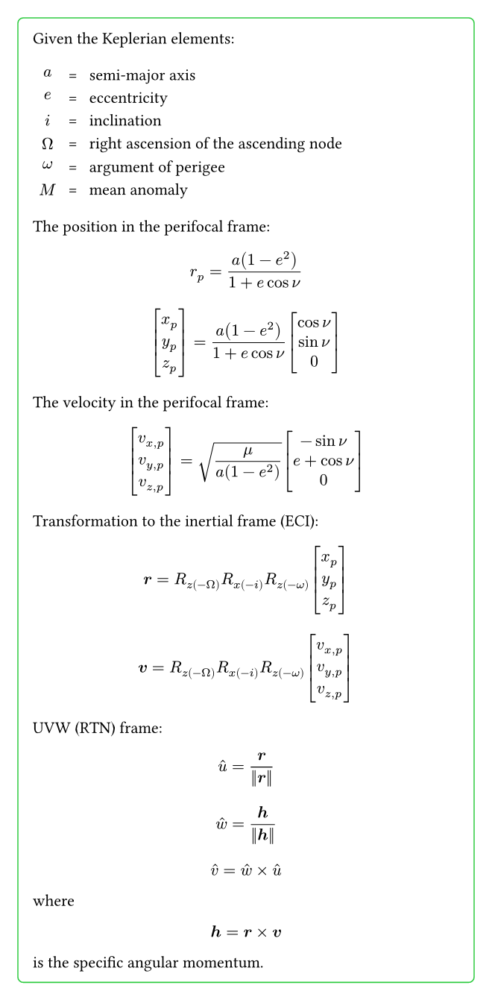
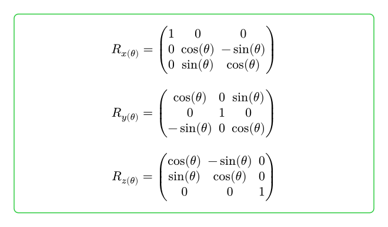

# Understand and use the SGP4 Library from space-track.org

## SGP4Prop

SGP4Prop is a famous propagation (the name Prop) library for satellite orbit prediction, which is widely used in the aerospace industry. The SGP4Prop library is developed and maintained by the United States Air Force, and it is available for free on the space-track.org website.

SGP4 stand for Simplified General Perturbations Model 4, which is a quasi-analytical solution of the equations of motion for Earth-orbiting satellites. It is designed to provide accurate predictions of satellite positions and velocities over short time intervals, typically up to a few days. SGP4Prop is based on the SGP4 model, which takes into account various perturbations such as atmospheric drag, gravitational effects from the Earth and other celestial bodies, and solar radiation pressure.

[SGP4Prop_v9.8](https://www.space-track.org/documentation#/sgp4)

You need to login to space-track.org to download the SGP4 library. You can create a free account if you don't have one. And a [License](SGP4_Open_License.txt) is included in this repository, which is needed to use the SGP4 library. SGP4Prop will search for the Licese file in the current directory.

And you have to dowanload the [SGP4 library](https://www.space-track.org/documentation#stModal) , and get Lib folder from the downloaded file, and put it in pysgp4 folder. The structure of pysgp4 folder should be like this:

```txt
pysgp4/
├── __init__.py
├── Lib
│   ├── Windows
│   │   ├── AstroFunc.dll
│   │   └── DllMain.dll
│   └── Linux
│       └── x86
│           ├── libAstroFunc.so
│           └── libDllMain.so
└── MacOS
    └── x86
        ├── libAstroFunc.dylib
        └── libDllMain.dylib
```

Here with uv manage the python venv, the SGP4 library imported to  Python by importing pysgp4.

### Architecture
The v9 SGP4 library is composed of several components. Only part of them are not export-controlled, SGP4Prop is source code export-controlled.




## Orbital mechanis basics

### How orbit is described

TLE (Two-Line Element set) is a data format used to describe the orbit of a satellite. It consists of two lines of text, each containing specific information about the satellite's orbit. The first line contains the satellite's name, its international designator, and the epoch time (the time at which the TLE was generated). The second line contains the satellite's orbital parameters, such as its inclination, right ascension of the ascending node, eccentricity, argument of perigee, mean anomaly, and mean motion.



### Oribtal Mechanics 甲乙丙

whos knows the law that makes things fall on the ground is the same that makes the moon orbit around the earth, and the earth orbit around the sun?


That's science and truth.


#### Orbital Elements

To describe an orbit, first define the orientation of the orbital plane using:

- inclination (i): the angle between the orbital plane and the equatorial plane, in degrees
- right ascension of the ascending node (Ω): the ascending node is where the satellite crosses the equatorial plane from south to north; Ω is the angle from the vernal equinox direction to the ascending node, in degrees

The orbit shape is described by three parameters:

- a (semi-major axis): the semi-major axis of the orbit, in kilometers
- e (eccentricity): orbital eccentricity (dimensionless)
- ω (argument of perigee): the argument of perigee, in degrees

Finally, the object's position on the orbit is described by one parameter:

- M (mean anomaly): mean anomaly, in degrees, or true anomaly, in degrees



In the figure, point P is the point on the ellipse closest to Earth (for a circular orbit, this point is conventionally chosen), called the perigee. The farthest point on the orbit is called the apogee.

In the figure, Ω and i describe how the orbital plane is oriented relative to the equatorial plane. Ω is the angle from the vernal equinox direction to the ascending node, and i is the angle between the orbital plane and the equatorial plane.

The argument of perigee ω is the angle from the ascending node to the perigee, while the mean anomaly M is the angle from the perigee to the satellite's position.

This description is useful, but when e=0 every point on the orbit is both perigee and apogee. In that case, ω is undefined, and M also becomes ambiguous.

To handle this more robustly, another representation was introduced: the equinoctial elements.

#### Equinoctial Elements

Keplerian elements (`a`, `e`, `i`, `Ω`, `ω`, `M`) are not well defined for circular orbits (e=0) and equatorial orbits (i=0), so the equinoctial elements are introduced to solve this problem. The equinoctial elements are defined as follows:

```python
# Calculate expected equinoctial elements based on the input Keplerian elements
_Ag = e * sin(radians(omega + raan))
_Af = e * cos(radians(omega + raan))
_chi = tan(radians(incli) / 2) * sin(radians(raan))
_psi = tan(radians(incli) / 2) * cos(radians(raan))
_L = (omega + raan + m0) % 360
MU_EARTH: float = pysgp4.EnvConst.EnvGetGeoConst(pysgp4.XF_GEOCON_MU)
assert MU_EARTH == 398600.8
# Gravitational parameter km ^ 3/(solar s) ^ 2
_N = sqrt(MU_EARTH / (a ** 3)) * 24 * 60 * 60 / (2 * pi)  # revs per day
```

#### Inertial frame and UVW frame

The UVW frame is a local orbital coordinate system. The u-axis points along the satellite's position vector (radial direction), the w-axis points along the orbital angular momentum vector (orbit normal), and the v-axis completes the right-handed frame. For a circular orbit, the v-axis aligns with the velocity direction; in general it is the in-track direction and is not exactly the same as the velocity vector when the orbit has a radial velocity component.

The following give a definition of the UVW frame from Keplerian elements, the transformation start from Keplerian elements to ECI frame, and then from ECI frame to UVW frame:




where rotation matrices are defined as:

